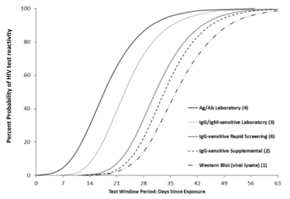

# Time Since Infection Calculator

Given a diagnostic history of a person, use the window period distributions of the relevant tests to compute a posterior distribution for the time of infection. This work is based on the approach described in (Grebe et al., 2019 BMC Infect Dis). The window period distributions are a key parameter and are mostly taken from (Delaney et al., 2017 Clin Infect Dis).

## Basic Explanation of Method

The window period distribution of an assay desribes the probability of an assay producing a positive test result as a function of time since infection. Given a test result, the window period distribution of the test provides information about the potential time of infection:

* If the result was negative, then an infecting exposure could not have happened too long before the sample was drawn. If person was infected a long time before the sample was drawn, then the test result will have been positive. (Assuming no false negatives)
* Likewise, if the result was positive, then the infection exposure must have been some amount of time before the sample was drawn. Since if the infecting exposure occurred very soon before the sample was drawn, then the biomarkers will not yet have developed to a detectable level and the test result will be negative.

Thus for each observed test result, a curve can be constructed indicating the probability of in fact observing that test result given that the infecting exposure was on some hypothesised day. Assuming independence, the product of these curves indicates the probability of observing *all* the results in the dataset given that the infecting exposure was on associated day. The curve representing the product is referred to as the aggregate curve.

Figure: The window period distributions of different classes of assays reported by Delaney et al., 2017.

Bibliography

Grebe, E., Facente, S.N., Bingham, J. et al. Interpreting HIV diagnostic histories into infection time estimates: analytical framework and online tool. BMC Infect Dis 19, 894 (2019). https://doi.org/10.1186/s12879-019-4543-9

Kevin P. Delaney, Debra L. Hanson, Silvina Masciotra, Steven F. Ethridge, Laura Wesolowski, Sherry Michele Owen, Time Until Emergence of HIV Test Reactivity Following Infection With HIV-1: Implications for Interpreting Test Results and Retesting After Exposure, Clinical Infectious Diseases, Volume 64, Issue 1, 1 January 2017, Pages 53–59, https://doi.org/10.1093/cid/ciw666
